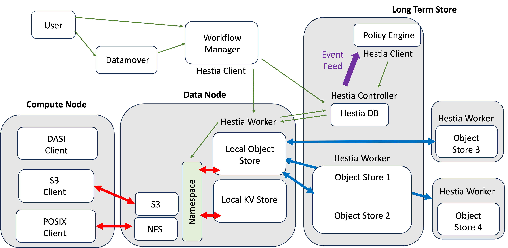
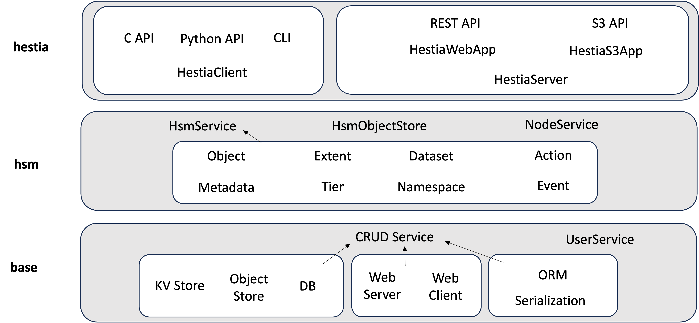

# Hestia User Guide

`Hestia` (Hierarchical Storage Tiers Interface for Applications) is a [Hierarchical Storage Management](https://en.wikipedia.org/wiki/Hierarchical_storage_management) (HSM) interface for Object Stores.

It can be used to add HSM functionality to standard Object Stores, as well as grouped operations on collections of Objects (`Dataset` feature) and general addressing (S3, POSIX etc) via a `Namespace`s feature.

This is the `Hestia` user guide, it covers:

- [Hestia User Guide](#hestia-user-guide)
- [Core Concepts](#core-concepts)
  - [Data Model](#data-model)
- [Runtime Modes](#runtime-modes)
- [Configuration](#configuration)
  - [Object Store Backend Settings](#object-store-backend-settings)
  - [HSM Settings](#hsm-settings)
  - [Server Settings](#server-settings)
  - [Event Feed](#event-feed)
- [APIs](#apis)
  - [Command Line Interface](#command-line-interface)
  - [C Interface](#c-interface)
  - [Python Interface](#python-interface)
  - [Web Interfaces](#web-interfaces)
    - [REST API](#rest-api)
      - [Authentication](#authentication)
    - [S3 API](#s3-api)
      - [Authentication](#authentication-1)
      - [Starting the server](#starting-the-server)
      - [Making requests](#making-requests)
- [Hestia as a System Service](#hestia-as-a-system-service)
  - [Systemd](#systemd)
- [Ansible Deployment](#ansible-deployment)
  - [Usage](#usage)
    - [Hestia Roles in your Playbook](#hestia-roles-in-your-playbook)
  - [Configuration](#configuration-1)
    - [Backend Types/Configurations](#backend-typesconfigurations)

# Core Concepts

The Core Concepts in Hestia are derived from the [IO-SEA](https://iosea-project.eu) project.

Hestia provides `Object Store` and `Key-Value Store` abstractions. Data blobs are kept in an Object Store, addressed with a `unique identifier`. `Metadata` is maintained in a Key-Value store.

Objects can be grouped in a `Dataset`. Object addressing in a Dataset is through `User` scoped keys or paths, which are defined via a `Namespace`. This concept has parallels with `S3` buckets and objects, but allows for more general addressing such as with POSIX filesystem semantics.

`Hestia` provides these abstractions via a middleware functionality in a distributed storage setting, supporting:

* `Key-Value Store` integration
* `Object Store` integration
* `HSM` concepts, such as `Storage Tier`s
* `Dataset` and `Namespace` IO-SEA concepts
* Mappings from standard addressing schemes (e.g. S3, REST) to IO-SEA schemes
* Distributed Communication and Syncronization over a network

## Data Model
The figure below shows the abstractions used in Hestia and their relationships. 


* `Node`: This is a Hestia server instance - it holds server address details and configuration of the application running on the server
* `Tier` : This is a Storage Tier in a HSM system - it represents a physical storage resource, with descriptive properties such as bandwitdh, capacity, storage media etc.
* `User` : Several Hestia resources are scoped to a user - they can be registered in Hestia with a unique username and authenticate with a system provided token.
* `Event` : Any events (such as resource creation, update, destruction etc) can be output to a feed for system analytics or Data Warehousing applications.
* `Dataset` : A Dataset is a group of Objects owned by a User, allowing for Object operation batching and hints for automated HSM movements.
* `Action` : A HSM action (data put, get, copy, move etc) requested by a User, it provides tracking and progress updates for long running operations.
* `Object` : A Storage object - it can point to a single object with data split over several storage tiers and also hold object metadata.
* `Namespace` : An addressing scheme (e.g. POSIX path) and permissions for Objects in a Dataset.
* `Extent` : An Object's data on a particular Storage Tier - it is a collection of block offsets and lengths, allowing random access for data put and get operations where supported by the third-party object store backend.
* `Metadata` : A collection of key-value pairs representing metadata for an Object. It is split from the parent Object model to allow for quicker access or indexing.

In the figure solid lines represent parent-child relationships, which are one-to-many unless explicitly specified one-to-one (x1). 

The Hestia API is primarily [CRUD](https://en.wikipedia.org/wiki/Create,_read,_update_and_delete)-like. Resources are most efficiently addressed via their unique identifier (or primary key) - but for convenience addressing via a human-readable `name` and reference to a `parent` is also supported. In all Hestia APIs the abstractions above are referenced in lower case (e.g. `node`, `tier`, `user`).

A typical CRUD operation is structured as `subject method id`, for example to create an object with a requested unique identifier would be:

```
object create 550e8400-e29b-41d4-a716-446655440000
```

Via `parent` addressing this would look like:

```
object create name=my_object_name parent=my_dataset_name
```

where the `User` parent of the referenced `Dataset` is inferred from a provided authentication token.


# Runtime Modes

The figure below shows an example application of Hestia in the IO-SEA project. In this scenario Hestia runs in several modes, including acting as a `Client` when putting and getting data to-and-from remote Long-Term Storage and as a `Server` when coordinating data streaming to remote workers interfacing third-party object stores on their nodes.



Overall, the `hestia` application has four runtime modes:

* `Client`: Used to operate directly with Object Stores at a low-level, or with Datasets and Namespaces at a higher level.
* `Client - Standalone`: A single-node version of Hestia, useful for testing.
* `Server - Controller`: Used as an entry-point and co-ordiantor for Hestia in a distributed system. Has direct access to the Key-Value Store interface.
* `Server - Worker`: Accepts commands from the Controller and provides an access-point for data streaming. 

In all modes the application can read from a user provided `config` file on the system on launch and maintain a light local `cache`.

# Configuration

Internally Hestia uses a custom serialization format which is a subset of JSON to convert between C++ objects and strings. As a result, many Hestia resources can be configured in a fine-grained way by serializing user-provided configs in YAML or JSON format.

The most direct way of providing a configuration is via a `yaml` file - which can be read from disk on launch. When launched as a systemd service, Hestia will use the config at `/etc/hestia/hestiad.yaml`, which provides some helpful defaults. 

Since the configuration schema is derived directly from the C++ code, the source code itself is the primary source of documentation for this yaml file, however some core settings are covered here as examples.

The internal Hestia architecture shown below may be a useful resource when searching the project for configuration options:



## Object Store Backend Settings

Hestia can interface with several Object Store backends at the same time, thus their configuration is provided as a Sequence of `object_store_client` types:

```yaml
object_store_clients:
  - backend_type: file_hsm
    tier_names: ["0", "1", "2", "3"]
    config: 
      root: hsm_object_store
  - backend_type: file
    tier_names: ["4"]
    config: 
      root: object_store
```

Here we have configured two clients, the first is a HSM enabled client which uses the local filesystem and the second is simple filesystem-based object store with one tier. We specify a `backend_type`, give the list of unique tier identifiers to be handled by the client in `tier_names` and any client-specific config as a sub-object of the `config` key.

The following backends are currently supported:

* `FileObjectStoreClient` : A client with objects stored in the local filesystem - this is mostly intended for testing/simulation
* `S3Client` : A client for S3 endpoints - implemented using [libs3](https://github.com/bji/libs3)
* `PhobosClient`: A client for the [Phobos](https://github.com/cea-hpc/phobos) library for tape-backed Object Stores
* `FileHsmObjectStoreClient` : A HSM enabled version of the `FileObjectStoreClient`
* `MotrClient` : A client for the HSM enabled [Motr](https://github.com/Seagate/cortx-motr) Object Store

In addition, a number of `Mock` versions of the above clients are available for testing and simulation.

## HSM Settings

When working with HSM systems we want to match a `Storage Tier` with an Object Store backend that can handle data operations for this tier, we can create this relationship in the config as follows:

```yaml
tiers:
  - name: "0"
  - name: "1"
  - name: "2"
  - name: "3"
  - name: "4"
```

Where the tier `name` is a unique identifier corresponding to the entires in the `object_store_clients` config. Each tier entry can have further configuration options than shown above (capacity, bandwith etc), a unique name is the minimum required config.

## Server Settings

Hestia can be used via a `Command Line Interface`, `c/Python APIs` or over a network. The network API is available as `Http` or `S3`. The `yaml` file allows specification of server configuration as follows:

```yaml
server:
  host_address: 127.0.0.1
  host_port: 8080
  web_app: 
    interface: http
  backend: hestia::Basic
```

The server will attempt to bind at the `host_address` and `host_port` when started. The `web_app.interface` attribute specifies which `Hestia` application to launch on the server. It currently supports:

* `http` : The `HTTP` interface to the Hestia - this exposes HSM operations as per the CLI (detailed later), but also a co-ordination API for distributed `Hestia` instances.
* `s3` : The `S3` interface to Hestia - this exposes an S3 Object Store interface with optional HSM support via header metadata.

Hestia currently supports two server backends with the `backend` option:

* `basic` : Use a simple (custom written) server implementation - this is very basic - only intended for local development and testing
* `proxygen` : User a server built on the [Proxygen](https://github.com/facebook/proxygen) library

## Event Feed

Hestia will optinally log resource-altering events to a YAML file specified by `event_feed_path` in the general config as shown below. 

```yaml
event_feed:
  path: event_feed.yaml
  active: y
```

For details see the [event feed](./internals/EventFeed.md) documentation.

# APIs

## Command Line Interface

The `hestia` application provides a command line interface supporting:

* CRUD operations on all Hestia abstractions (models)
* A `HSM Action` (put, get, copy, move, release data) API for Objects and Datasets
* Server and Deamon control

A simple example is shown in the [top-level README](../README.md) in the project.

The CRUD interface is low-level and general to allow easier adaptation as the needs of the parent IO-SEA project change. Since the `hestia` application is launched once per operation it is designed to support batch-inputs.

The main flags are:

* `input_fmt`: Specifies whether json or a combination of unique-identifiers and key-value pairs are expected in the input.
* `output_fmt`: Controls whether the output will be in json or a combination of unique identifiers and key-value pairs.
* `id_fmt`: Specifies whether input identifiers are in the format of unique-identifiers or human readable `names` and `parent` names (see notes on [Addressing](#core-concepts) in the Core Concepts section above).

Depending on the input form specifiers input will be expected as trailing command-line arguements or via `stdin` on launch. A typical batch run would have a format like:

```bash
hestia object create --input_fmt=key_value --output_fmt=json < requested_object_ids.dat > my_new_objects.json
```

with `requested_object_ids.dat` being a new-line-separated sequence of unique identifiers.

When running from the CLI a local `cache` will be created - with a default location in `$HOME/.cache/hestia`. This will contain application logs and, if configured, object and key-value store caches.

When working with a remote server rather than specifying it in the config you can directly point the client to it with an address and port:

```bash
hestia object create --host=127.0.0.1 --port=8080
```

for example for a hestia server running on localhost.

## C Interface
The C interface can be consumed via the `hestia.h` header and linking to the Hestia shared library `libhestia`. The header file documentation is the recommended reference for its use.

No special dependencies, compiler flags or definitions are needed by default, but CMake and Autotools examples are included in the [examples](/examples/) directory for convenience.

For similar reasons to the CLI, the interface is designed to be adaptable to meet the fluid requirements of the parent project - this is manifested by relying on strings and format specifiers as primary input and output arguments. The semantics are similar to the CLI - with a `hestia_subject_method` pattern for CRUD operations. 

## Python Interface
The Python interface includes both a low-level wrapper over the C interface (`hestia.HestiaLib`) and a high-level `hestia.HestiaClient` class, which is easier to use and more closely follows IO-SEA API conventions. The low-level wrapper can serve as a fall-back for anything missing in the client.

If you built Hestia from source you can add the `hestia` package to the `PYTHONPATH` with:

```bash
export PYTHONPATH=$PYTHONPATH:$HESTIA_BUILD_DIR/lib/python/hestia
```

or if you installed a binary package it will look something like:

```bash
export PYTHONPATH=$PYTHONPATH:/usr/lib/hestia/python/hestia
```

`libhestia` should be found automatically, but if there are issues finding it you can manually add its location to your `LD_LIBRARY_PATH`.

As an example of using the Python interface, we can do something like:

```python
import hestia

# Setup some data
my_object_id = "1234"
my_attributes = {"key0" : "val0", "key1" : "val1"}
my_content = b"content for storage"

# Create the client - this will initialize it too
client = hestia.HestiaClient()

# Create an object with the requested id
client.object_create(my_object_id)

# Add USER attributes to the object
client.object_attrs_put(my_object_id, my_attributes)

# Add data to the object
client.object_data_put(my_object_id, my_content)

# Get the USER attributes back
attributes_returned = client.object_attrs_get(my_object_id, len(my_content))

# Get the data back
data_returned = client.object_data_get(my_object_id)
```

Many other operations are supported, see `bindings/python/hestia/test/test_binding.py` for detailed examples.

## Web Interfaces

Hestia provides two primary web-interfaces (S3 and generic REST) through which a number of web-apps (`Worker` and `Controller`-like) can be run. 

The web-apps are run on a Proxygen web-server (with a basic custom-built server provided for testing).

The server can be run blocking or as a daemon depending on the supplied command line flags - with the loaded app controlled by the supplied `yaml` config.

### REST API
As an example of a REST API, start the Hestia service

```bash
export HESTIA_ENDPOINT=127.0.0.1:8080
hestia start
```

For convenience the server will host a web-view of the state of the Hestia system at: http://localhost:8080, which you are encouraged to explore.

#### Authentication
Requests for creating resources need to include information about the User making the request. Hestia currently supports a simple token-based Authentication. To find the token for the default user you can go to: http://localhost:8080/api/v1/users in your web browser.

Create a new object do:

```bash
curl -X PUT -H "authorization: DoaDrn1Y5h/8KTpYE/DXUGimWhpMk5e/Y3utspFArc8=" $HESTIA_ENDPOINT/api/v1/objects
```

where the header `authorization: DoaDrn1Y5h/8KTpYE/DXUGimWhpMk5e/Y3utspFArc8=` contains your token. This returns the object in json form:

```json
{"creation_time":"1694686359645111","dataset":{"id":"17ab0a87-cb5f-343b-a1c2-7d0cce08ddf4"},"id":"550e8400-e29b-41d4-a716-446655440000","last_modified_time":"1694686359645111","read_lock":{"active":"false","locked_at":"0","max_lock_time":"5000"},"size":"0","tiers":[],"type":"object","user_metadata":{"creation_time":"1694686359641160","data":{},"id":"bb160846-4928-555f-c0dd-944cc1504d29","last_modified_time":"1694686359641160","object":{"id":"550e8400-e29b-41d4-a716-446655440000"},"type":"metadata"},"write_lock":{"active":"false","locked_at":"0","max_lock_time":"5000"}}
```

The object id will be returned in the `id` field in the response `json`. To add data to the object with id `550e8400-e29b-41d4-a716-446655440000` we create a HSM action:

```bash
curl -X PUT --upload-file "my_file.dat" \
  -H "hestia.hsm_action.action: put_data" \
  -H "hestia.hsm_action.subject_key: 550e8400-e29b-41d4-a716-446655440000" \
  -H "authorization: DoaDrn1Y5h/8KTpYE/DXUGimWhpMk5e/Y3utspFArc8=" \
  $HESTIA_ENDPOINT/api/v1/actions/
```

Note the use of the HTTP Header to provide metadata, as the body is reserved for object data streaming. The header is a direct serialization of the C++ `Action` instance - the corresponding source code documentation can be used for reference.

```bash
  % Total    % Received % Xferd  Average Speed   Time    Time     Time  Current
                                 Dload  Upload   Total   Spent    Left  Speed
100   249    0     0  100   249      0    241  0:00:01  0:00:01 --:--:--   242
```

Copy it to another tier, tier `1`:

```bash
curl -X PUT -H "hestia.hsm_action.action: copy_data" \ 
            -H "hestia.hsm_action.source_tier: 0" \
            -H "hestia.hsm_action.target_tier: 1" \
            -H "hestia.hsm_action.subject_type: object" \
            -H "hestia.hsm_action.subject_key: 550e8400-e29b-41d4-a716-446655440000" \
            -H "authorization: DoaDrn1Y5h/8KTpYE/DXUGimWhpMk5e/Y3utspFArc8=" \
            $HESTIA_ENDPOINT/api/v1/actions
```

Not we specify the `subject_type` in this case, to make the operation distinct from copying a full `dataset`.

Next we retrieve the data from the version on tier `1`:

```bash
curl -H "hestia.hsm_action.source_tier: 1" \
     -H "hestia.hsm_action.subject_key: 550e8400-e29b-41d4-a716-446655440000" \
     -H "hestia.hsm_action.action: get_data" \ 
     -H "authorization: DoaDrn1Y5h/8KTpYE/DXUGimWhpMk5e/Y3utspFArc8=" \
  $HESTIA_ENDPOINT/api/v1/hsm/actions
```

Stop the Hestia service

```bash
hestia stop
```

### S3 API

#### Authentication
Similarly to the REST API case we need user authentication information before making s3 requests. The easiest way to get it for the default user is from the REST web-view at http://localhost:8080/api/v1/users. 

You can do something like:

```bash
hestia start
# Read user details in browser or via curl etc
hestia stop
```

You will need the default user name (`name` attribute) and token (`tokens[0].value`).

#### Starting the server

To start the server with an S3 interface we need to supply a config.yaml to override the default 'rest' interface, it will look like:

```yaml
server:
  web_app: 
    interface: s3
```

then we can do:

```bash
hestia start --config=my_s3_config.yaml
```

to start the server.

#### Making requests

This example uses Amazon's `boto` Python S3 client library: `pip install boto3`.

```python
import boto3
from botocore.client import Config

# Add the user name and token obtained from the rest interface - described above
session = boto3.session.Session(aws_access_key_id="MY_USER_NAME", aws_secret_access_key="MY_USER_TOKEN")

# Here HESTIA_ENDPOINT is something like http://127.0.0.1:8080
# Hestia best supports path based addressing style for s3
# Payload signing is currently not supported
client = session.client(service_name='s3', 
  endpoint_url="HESTIA_ENDPOINT", 
  config=Config(s3={'addressing_style': 'path','payload_signing_enabled' : False}))

# Bucket and Dataset are interchaneable notions here
my_bucket_name = "my_bucket"
my_object_name = "my_object"
my_metadata = {"mykey0" : "myvalue0"}
my_file_to_upload = "test.dat"

# Create the bucket
client.create_bucket(Bucket=my_bucket_name) 

# Upload the file - this also creates the object and adds any metadata
client.upload_file(Filename=filename,
  Bucket=my_bucket_name,
  Key=my_object_name,
  ExtraArgs={"Metadata": my_metadata})
```

Stop the Hestia service

```bash
hestia stop
```

# Hestia as a System Service

## Systemd

When installed as an RPM package, Hestia will add a service unit file for launching the server. The default configuration for this server is in `/etc/hestia/hestiad.yaml`.

This service can be controlled as normal using `systemd``:

```bash
systemctl enable hestiad # The hestia server will be started on login
systemctl start hestiad # Start the server (once-off)
systemctl status hestiad # Check the server's status
systemctl restart hestiad # Restart the server (will reload the configuration file)
```

Logs will be written to the system log, which can be viewed with `journalctl`.  

# Ansible Deployment

Ansible roles featuring scripts and configuration templates for Hestia's deployment on a multi-node cluster are demonstrated [here](/examples/sample_ansible_deploy/playbook.yml).  

## Usage

### Hestia Roles in your Playbook

As specified in [the example playbook](/examples/sample_ansible_deploy/playbook.yml), we can use the roles `hestia_controller_node` and `hestia_worker_node` given to setup a hestia cluster consisting of one or more controller nodes, each of which owns one or more worker nodes. By default, this will use the Redis key-value store on the controller node.

The playbook syntax to use these roles to configure your controller and worker is as follows, assuming you have a group of hosts defined for `hestia_controllers` and `hestia_workers` in your inventory: 

```yaml
---
- hosts: hestia_controllers
  roles:
    - hestia_controller_node

- hosts: hestia_workers
  roles:
    - hestia_worker_node
```

## Configuration

An example inventory for a three node test setup is provided. The following variables are supported when provided in your inventory variables and are propogated to the relevant config files on the nodes. Specifiying different values for different groups is possible as detailed in the ansible documentation and can even be set differently for individual nodes.

| Variable Name | Default Value | Notes |
|---|---|---|
| `iosea_repo_url` | `http://www.somerepo.com/iosea` | The url of the YUM repository including the `hestia` package |
| `hestia_server_port` | `8080` | The port used for all Hestia servers on nodes |
| `hestia_controller_address` | `hestia-controller` | The address of the controller node for the targeted workers |
| `hestia_hsm_tiers` | 5 File HSM backend tiers | List of tier names and their [backend types](#object-store-backend-settings) |
| `hestia_backends` | File HSM default config | A list of configurations sent to all target workers with the listed backend |


### Backend Types/Configurations

Configuration options for all backends are given under the `config` map in the `hestia_backends` option, as in the regular configuration files for Hestia. For example: 
```yaml
  hestia_backends:
    - type: "file_hsm"
      config: 
        - hsm_root: "hsm_object_store"
``` 
