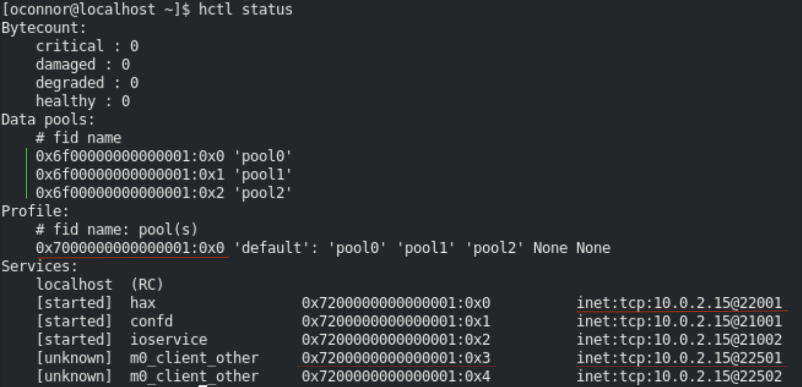

Download motr rpms from hestia repo, under Deploy > Package registry. Set an environement variable for their location as 

Note: If you have not yet installd the hestia base dependencies, do so before installing the rpms.

```bash
    cd hestia
    yum install -qy epel-release
    yum config-manager --set-enabled powertools
#    yum install -qy $(cat infra/deps/rocky8/base)
```

To install motr from the rpms provided in the hestia gitlab package registry, download the tarball from the repository and expand it, then run the following script (found in infra/scripts), ensuring that the argument passed in is the path to the top level 'builds' folder

```bash 
    sudo sh install_motr_rpms.sh path/to/builds/folder    
```

You can verify Your network protocol and interface were set correctly using:  

```bash 
cat /etc/libfab.conf
```
and see that the output is similar to

```bash
networks=tcp(enp0s3)
```

If this has not been set, use the `ifconfig` or `ip` commands to find your network interface and protocol and populate the config file. 

Download the iosea motr vm at https://github.com/Seagate/cortx-motr/releases/tag/iosea-vm-v2.1, and use the README.txt file and enclosed scripts to start the motr cluster. Download the disks.sh script and run: 

```bash 
./disks.sh
```

This will create the folder var/motr in your home directory. 

Download the singlenode.yaml file and replace instances of /home/seagate with the path to your home folder, or wherever your var/motr directory containing the disk images is located. Also ensure the interface matches the interface provided suring the configuration step. Once this is done you can set up the cluster.

```bash
sudo hctl bootstrap --mkfs ~/singlenode-multipools.yaml
```

To verify that the cluster is running and to get the correct information for the next steps, run 

```bash 
hctl status
```

You should get an output that looks like the following: 



Use the output to set the following environment variables, underlined in red in the image

```bash
export CLIENT_PROFILE="<0x7000000000000001:0x0>"    # profile id
export CLIENT_HA_ADDR="inet:tcp:10.0.2.15@22001" # ha-agent address
export CLIENT_LADDR="inet:tcp:10.0.2.15@22501"   # local address
export CLIENT_PROC_FID="<0x7200000000000001:0x3>"    # process id

m0composite "$CLIENT_LADDR" "$CLIENT_HA_ADDR" "$CLIENT_PROFILE" "$CLIENT_PROC_FID"
```

Use the information about the pools (noted with green in the image) to populate the `~/.hsm/config file`: 

```bash
cat ~/.hsm/config
M0_POOL_TIER1 = <0x6f00000000000001:0x0>
M0_POOL_TIER2 = <0x6f00000000000001:0x1>
M0_POOL_TIER3 = <0x6f00000000000001:0x2>
```

Build hestia against motr, from the build directory: 

```bash
export MOTR_SRC_CODE=/path/to/cortx-motr/repo
cmake /path/to/hestia/repo -DHESTIA_WITH_MOTR=ON -DMOTR_SRC_DIR=$MOTR_SRC_CODE -DBUILD_SHARED_LIBS=OFF -DCMAKE_BUILD_TYPE=Debug -DCMAKE_EXPORT_COMPILE_COMMANDS=ON -DCMAKE_C_COMPILER=gcc -DCMAKE_CXX_COMPILER=g++ 
make -j 4
```

Set the library path to pick up the hestia libraries

```bash
export LD_LIBRARY_PATH=/path/to/build/lib
```

Add the output from hctl status to the hestia config file, under the header `object store clients`. An example can be found in `test/data/configs/motr/hestia_motr_tests.yaml`.

```yaml
object_store_backend:
  - backend_type: motr
    tiers: 
      ids: ["00000000-0000-0000-0000-000000000001",
            "00000000-0000-0000-0000-000000000002",
            "00000000-0000-0000-0000-000000000003"]
    config: 
      root: motr_tests_object_store
      source: plugin
      type: hsm
      plugin_path: libhestia_motr_plugin
      ha_address: "inet:tcp:10.0.2.15@22001"
      local_address: "inet:tcp:10.0.2.15@22502"
      proc_fid: "<0x7200000000000001:0x4>"
      profile: "<0x7000000000000001:0x0>"  
      tier_info: "name=M0_POOL_TIER1,identifier=<0x6f00000000000001:0x0>;name=M0_POOL_TIER2,identifier=<0x6f00000000000001:0x1>;name=M0_POOL_TIER3,identifier=<0x6f00000000000001:0x2>"
```

Use the heading `tier_registry` to register the tiers to the motr backend

```yaml
tier_registry:
  - identifier: 0
    client_identifier: hestia::MotrClient
  - identifier: 1
    client_identifier: hestia::MotrClient
  - identifier: 2
    client_identifier: hestia::MotrClient


```

Start the hestia server with this config file. To add the 