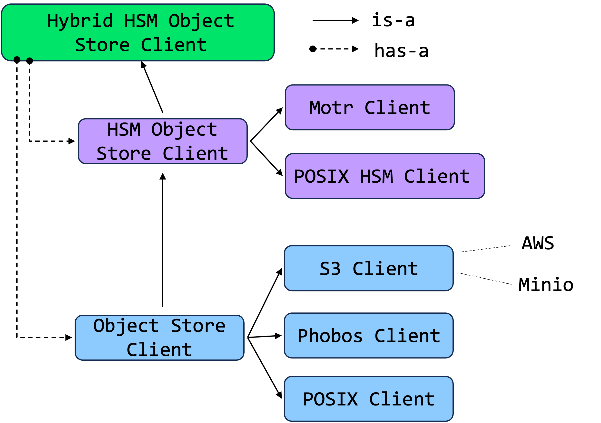

This example demonstrates IO-SEA copytool functionality by moving content to/from a file based store and `Mock` phobos.

# Copytool

The Copytool’s role is to copy objects between different object store backends. 

The copytool implementation is supported by two abstractions: `HSM Object Store Client` interface, an object store supporting some notion of HSM, such as Motr and `Object Store Client` interface representing a standard single tier object store, such as Phobos.
The Copytool uses a HSM Object Store Client interface, with its implementation as a
Hybrid HSM Object Store Client as shown in the figure below, managing other Object Store Clients (e.g. Phobos and Motr) to copy data between them.



# Start a server

Add /path/to/hestia/executable in your PATH. 

```sh
hestia server --config hestia.yaml
```
Here we have configured two backends, the first is simple filesystem-based object store with two tiersand the second one is mock version of phobos. 

# Run the script

Default location of the local cache is in $HOME/.cache/hestia. You may want to clean the previous logs and object and key-value store caches.
You can run the script with:

```sh
sh copytool_sample.sh
```
which will create an object, upload a temporary file to it, copy file from Storage Tier tier 0 to tier 1 and tier 2, move from tier 1 to tier 3 and  copy back from tier 3 to tier 1.
