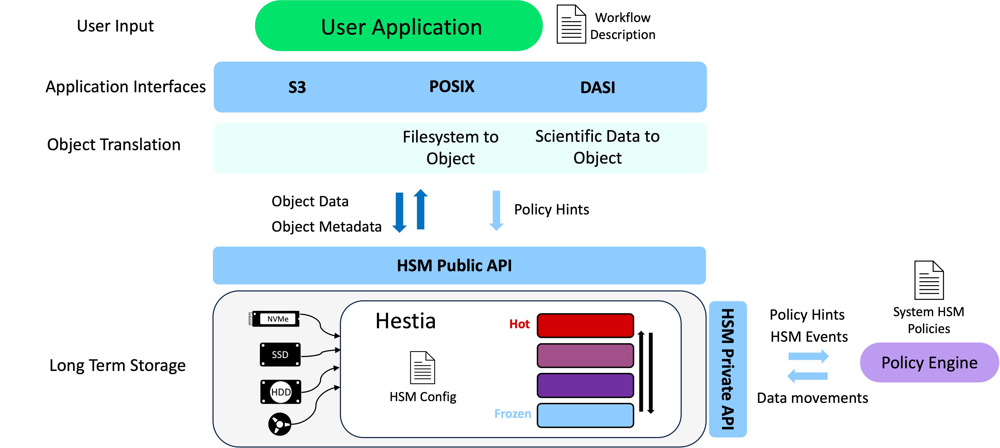
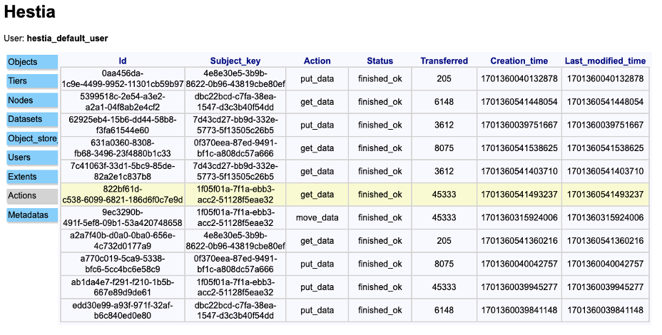

# Hestia Integrations

These tools are to help sanity check the IO-SEA HSM API and may also be useful as a guide on how to use the API in `hestia_iosea.h`. They need to be built from source rather than used in an installed version.

The tools mock out different elements of the IO-SEA system - implementing what you see in the figure. 

Overall, we can use them to:

* sync a filesystem to the object store (local or remote), using the `SyncTool`. 
* apply policy hints to an object via its metadata using the `Datamover` tool.
* Create a mirror db of the object store state and monitor the Hestia Event feed for updates and policy hints. The hints can be enacted via the IO-SEA HSM private API.

First we will run through in 'local mode' - where all tools are directly accessing the Hestia db on a system.

## Local Mode

* Start the Hestia server so you can follow along with the web-view: `hestia server start`. 
* Navigate to `127.0.0.1:8080` and log in with `hestia_default_user` and `my_user_pass`. Click around to explore the contents of the Hestia DB.

.

* Create a directory `my_directory` and add some interesting files. Subdirectories are fine, but not symlinks etc.
* Sync the directory to the object store as a dataset with `hestia_sync_tool archive --work_dir my_directory`. It will make an object per file and save the path as metadata. Check the web-view to see the content. Note the object id of the dataset which is printed in the standard out (e.g. `archived dataset to object: 4e8e30e5-3b9b-8622-0b96-43819cbe80ef`).
* Start the policy engine with `hestia_policy_engine listen .cache/hestia`  where the last arg is the location of the hestia cache (e.g. where the event feed and log files are). This will do an initial sync with an sqlite db and then listen to the event feed for updates.
* Trigger a data migration between tiers with the datamover tool `hestia_datamover object 1f05f01a-7f1a-ebb3-acc2-51128f5eae32 trigger_migration=0,1`. Here the uuid is for some arbitary object, you can use the web-view to pick one.
* This will have updated the event feed and in turn triggered the policy engine to start a data move between tiers.
* Create a new directory to restore into `my_directory_restored`.
* Restore the filesystem there with `hestia_sync_tool restore --work_dir my_directory_restored --dataset_id 4e8e30e5-3b9b-8622-0b96-43819cbe80ef` where the last arg is the id of the object containing the dataset, which were recorded earlier when doing the archive.
* Now `my_directory_restored` and `my_directory` should have the same content.

## Remote Mode

This is how the tools would be used in a multi-user/multi-system setting. We start the hestia server with some storage backends:

* `hestia server start --config <path_to_config_with_backends>` - see [sample config files](/test/data/configs/).
* You can pass a config file to the tools with the `--config` flag pointing to the server (controller) - similar to the CLI case 
